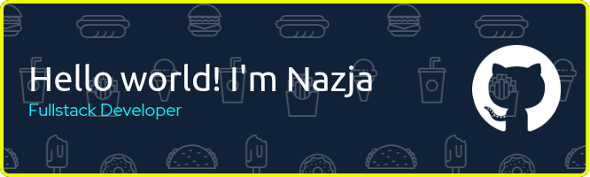

### Hello World 

- 🔭 I’m currently working as fullstack developer
- 🌱 I’m currently learning about **web frontend** and **DevOps**

### Tech Stack

### Get in touch with me

&nbsp;&nbsp;&nbsp;

### Git Stats

<picture>
  <source media="(prefers-color-scheme: dark)" srcset="https://raw.githubusercontent.com/nazjapermana/nazjapermana/output/pacman-contribution-graph-dark.svg">
  <source media="(prefers-color-scheme: light)" srcset="https://raw.githubusercontent.com/nazjapermana/nazjapermana/output/pacman-contribution-graph.svg">
  
</picture>

&nbsp;

<!--
**nazjapermana/nazjapermana** is a ✨ _special_ ✨ repository because its `README.md` (this file) appears on your GitHub profile.

Here are some ideas to get you started:

👋
- 🔭 I’m currently working on ...
- 🌱 I’m currently learning ...
- 👯 I’m looking to collaborate on ...
- 🤔 I’m looking for help with ...
- 💬 Ask me about ...
- 📫 How to reach me: ...
- 😄 Pronouns: ...
- ⚡ Fun fact: ...
-->
